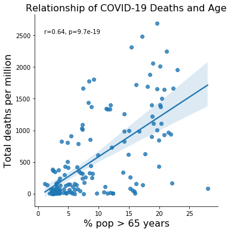

# What do the numbers of the COVID-19 pandemic tell us?

Ihave been fortunate enough to have lived 32 years without ever really have to think about viral infections, without being afraid of contracting a disease just simply by breathing or by living my normal life. The HIV epidemic was long under control by the time I was an adult, the Ebola epidemics that occasionally surface never really became a threat in the western world and the SARS/MERS pandemics never really affected my life either. The idea that a virus could wreck my life havoc was literally a matter of some very interesting science fiction movies like Outbreak or the more recent Contagion. So, when I started hearing about a viral outbreak in China in early 2020 I didn’t make much of it, I went about my life as always. It wasn’t until Governor Cuomo declared New York on “pause” on March 20th 2020 that I realized that my life was about to become the plot of a science fiction movie. The city that never sleeps, was now a ghost town. I was living in New York City but it really felt like I was living in the middle of a war zone. Ambulance sirens and helicopter sounds became a permanent companion. As I watched the news from the safety of my privilege it struck me that we were in for a long and wild ride. More than a year later, our lives have been transformed (perhaps permanently) by this tiny little virus that no one can see yet has affected everyone’s lives and taken the lives of far too many.

SARS-CoV-2, the virus that causes COVID-19, belongs to the broad family of RNA virus known as coronaviruses. The human population has long experienced infections from coronaviruses in the form of common colds. However, occasionally by some random chance (or better said evolution!) sometimes these coronaviruses become more pathogenic and cause severe diseases such as MERS (fatality rate of 34%) or SARS (fatality rate of 14%). While it is not clear when and how exactly SARS-CoV-2 originated, it is clear that its pathogenicity has not only affected our lives but put some real strain in the healthcare system and the economy worldwide. Here, I dive into the numbers of this pandemic with the hopes to learn important lessons for the future.
According to the World Bank, as of April 22nd 2021, 143 million people have been infected with SARS-CoV-2 and 3 million have succumbed to it. But how do these numbers breakdown per country?

These are absolute number of infections and deaths, however to be able to fully understand these numbers, we need to know what it actually means for each country’s population. Below you can see the 25 countries with the highest and the lowest total cases of COVID-19 per million.

As I was thinking about the COVID-19 pandemic and the meaning of this numbers, I was curious to see whether the mortality associated with COVD-19 has any relationship with the economic state of each country. My reasoning being that higher income countries are better organized, have better healthcare systems and have more access to the best medical professionals and top of the line treatments. The World Bank assigns the world’s economies to four income groups – low, lower-middle, upper-middle, and high-income countries – based on each country’s gross national income. Looking at the 25 countries with the highest and the lowest total COVID-19 deaths per million and how they are distributed among the four income groups, it is clear that lower income countries do not have disproportionally high COVID-19 caused deaths. Instead, COVID-19-related deaths are disproportionally occurring in high income countries, while lower income countries have relatively low COVID-19-related deaths.

Below you can see the breakdown of COVID-19 caused deaths per million in each of the country used in this analysis.
Top 25 Countries

Bottom 25 Countries

This got me thinking, even though the economic status of a country does contribute for their ability to handle the logistics of a pandemic, they do not adequately address the biological modifiable factors that play a very important and personal role in susceptibility to infection, as well as pathogenicity (their ability to cause disease). Old age and comorbidities, such as diabetes, are known to increases susceptibility to infections and affect the trajectory of infectious diseases. Therefore, I wondered if the death rate of COVID-19 is related to the proportion of old people in each country as well as the proportion of people with diabetes. I have also considered the proportion of obese people in each of these countries, as obesity is a comorbidity that also affects how the body handles infections. To test this, I once again used the data from the World Bank on these variables and performed a correlation analysis.

Interestingly, while the percentage of diabetes and obesity does not correlate with COVID-19 deaths, the percentage of old people (older than 65 years old) does, implying that the COVID-19 potential for mortality is higher in countries with aged populations. Below is a deeper analysis of the relationship of old age and COVID-19-related deaths using the regression method.

From this analysis it is clear that the oldest the population of a country the higher the risk of serious complications and death arising from SARS-CoV-2 infection. This is independent of the economic status of a country, however countries with high income tend to have a higher percentage of older populations. Moreover, this analysis does not account for compliance with the mitigating public health strategies such as social distancing and masks. While lower income countries may not have the luxury of social distancing and availability of good quality masks, in higher income countries (especially in the US) masks have become a matter of political contention which further increases the risk of infection and mortality for the elderly.
It’s been over a year since COVID-19 stormed our lives. In hindsight, there was so much that we as a society could (and should) have done to mitigate the astronomical loss of life inflicted by COVID-19. Yet, looking at the world now, it feels as if we haven’t learned a single thing: surges of COVID-19 continue to occur all around the world and our elders (and other age groups) continue to die.

